## Overview

This is a study of [*An Electronic Market-Maker*](http://dspace.mit.edu/handle/1721.1/7220) by Nicholas Tung Chan and Christian Shelton.

#### 01 - Expected Profit

This is a Monte Carlo simulation of the basic model that computes the expected profit. The following is a reproduction of Figure 3 from the paper:

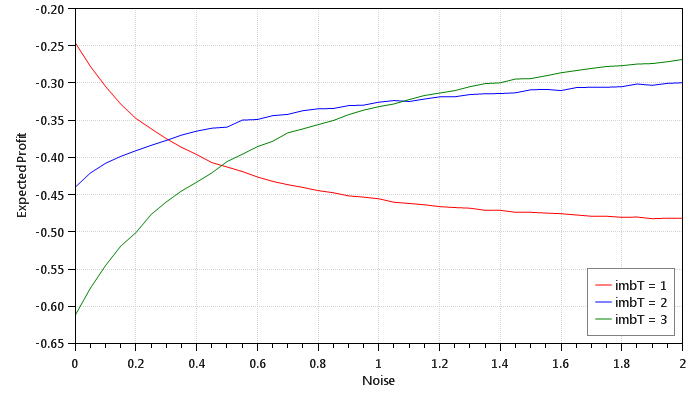

These are plots of the true price and market price for strategies 1, 2, and 3, respectively, when the noise factor alphaU = 0.4:

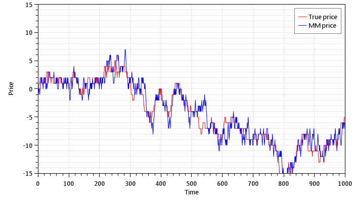
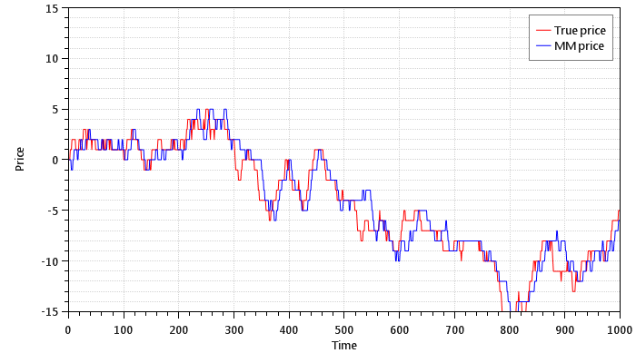
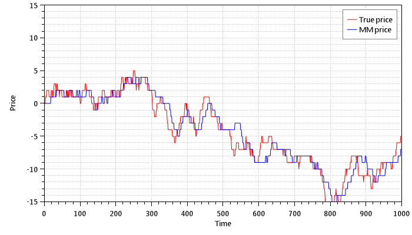

These are plots of the true price and market price for strategies 1, 2, and 3, respectively, when the noise factor alphaU = 1.0:

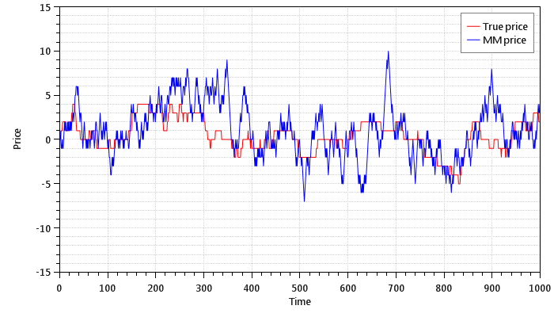

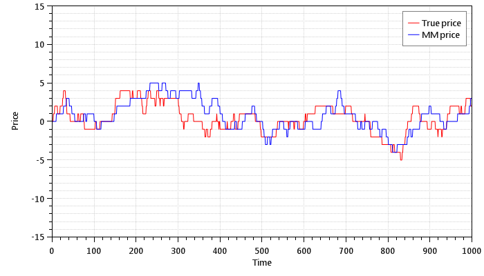

These are plots of the true price and market price for strategies 1, 2, and 3, respectively, when the noise factor alphaU = 1.6:

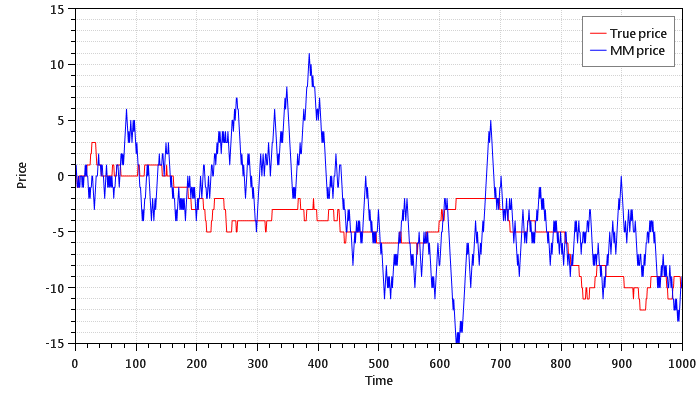
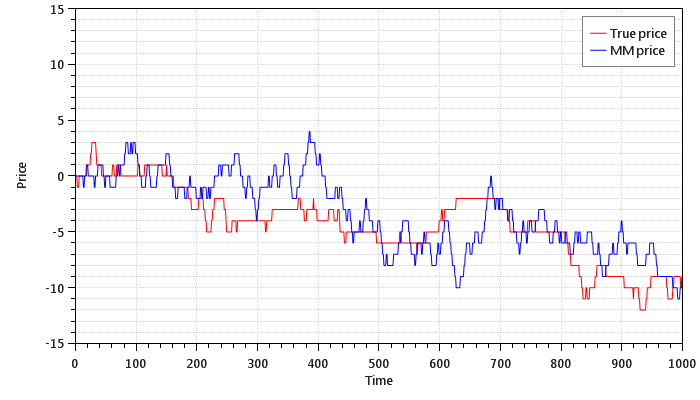
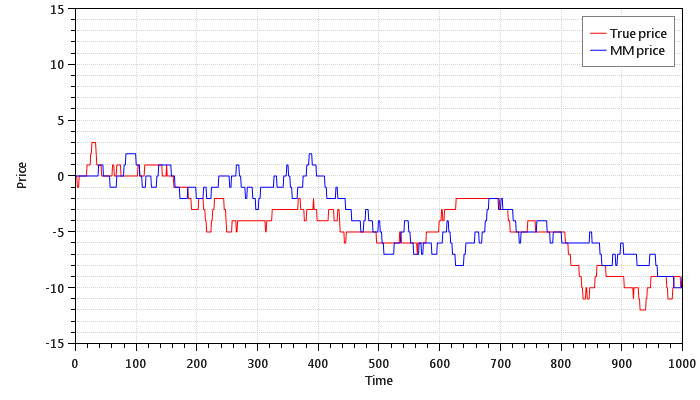

#### 02 - Basic Model (SARSA)

This is an implementation of the basic model that uses the SARSA learning method to choose the optimum strategy. The following is a reproduction of Figure 5 from the paper:

* Episode 25

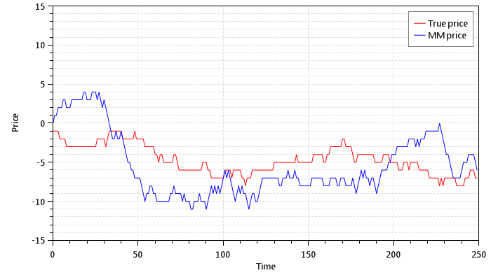

* Episode 100

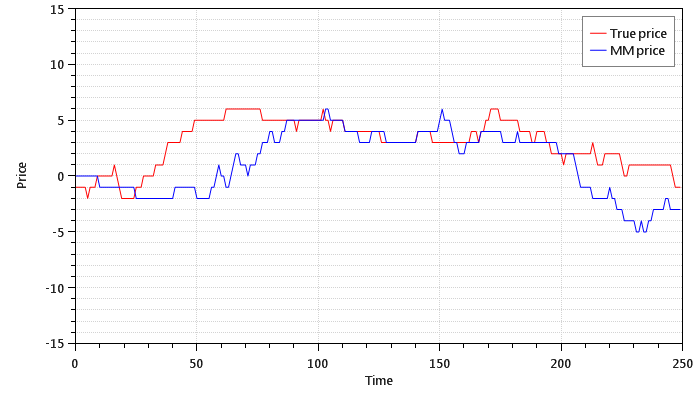

* Episode 200

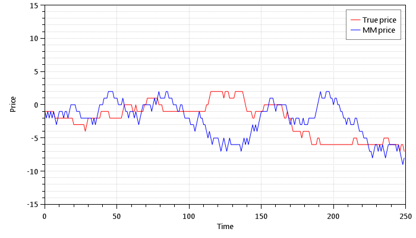

* Episode 500

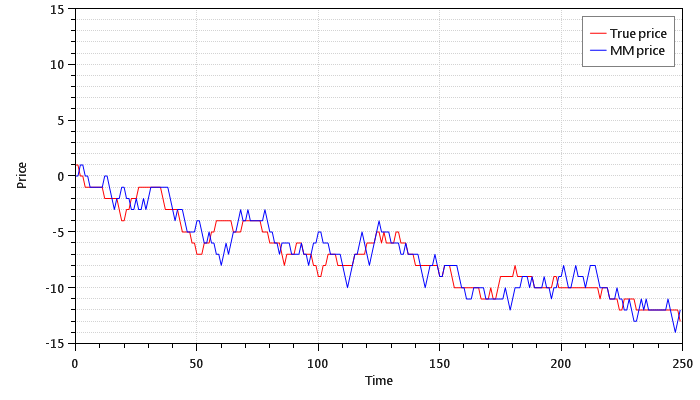

The following is a reproduction of Figure 6a from the paper:

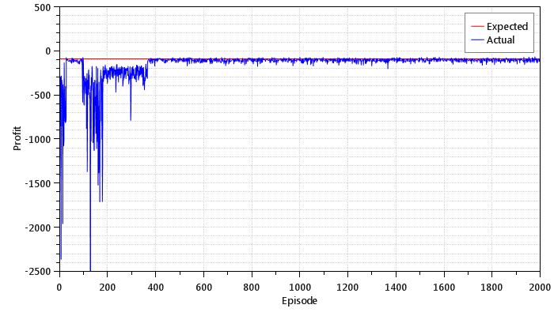

The following is a reproduction of Figure 6b from the paper:

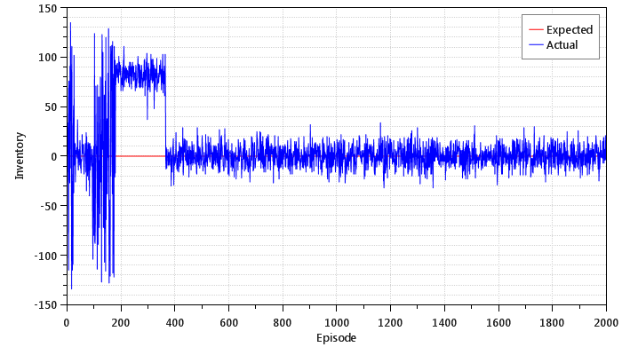

The following is a reproduction of Figure 6c from the paper:

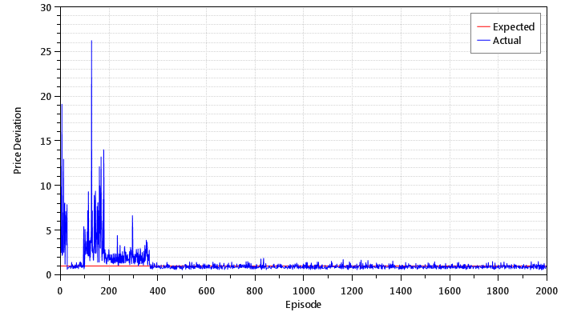

#### 03 Extended Model (SARSA)

This is an implementation of the extended model that uses the SARSA learning method to choose the optimum spread. The following is a reproduction of Figure 9 from the paper:

* Episode 25

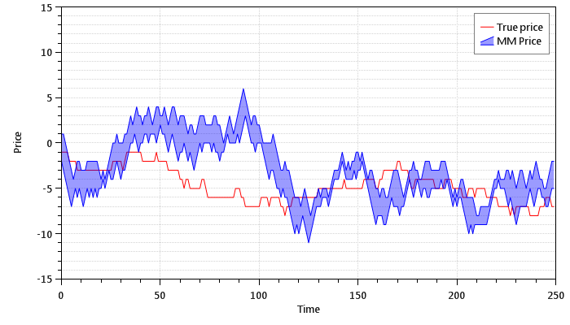

* Episode 100

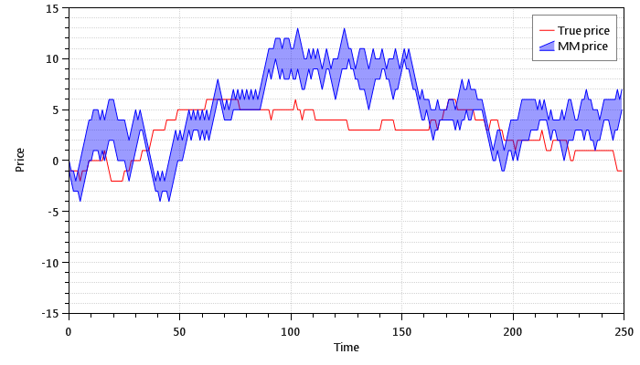

* Episode 200

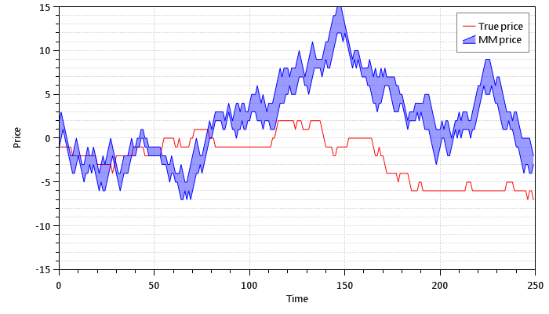

* Episode 500

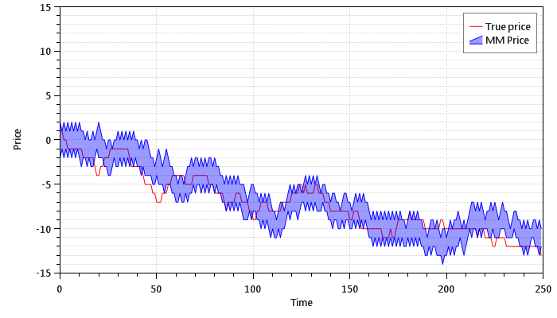

The following is a reproduction of Figure 10a from the paper:

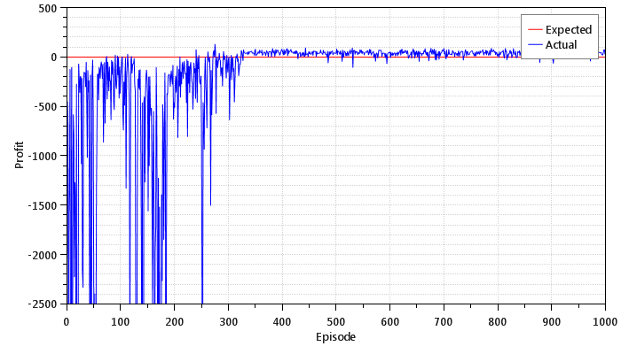

The following is a reproduction of Figure 10b from the paper:

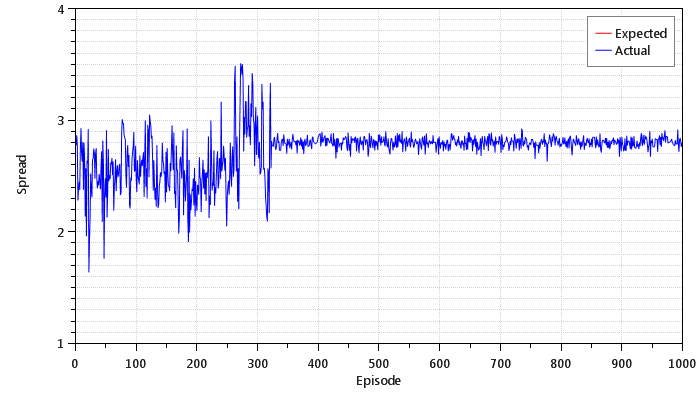

The following is a reproduction of Figure 10c from the paper:

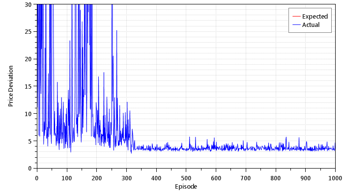

The following is a reproduction of Figure 10d from the paper:

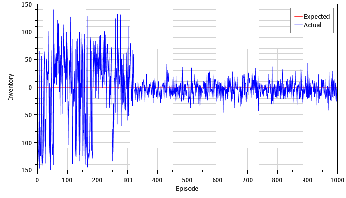
