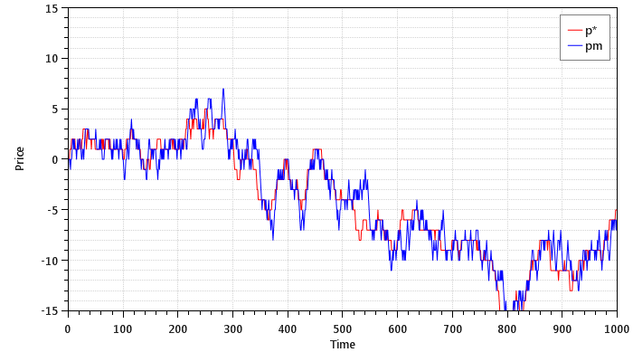
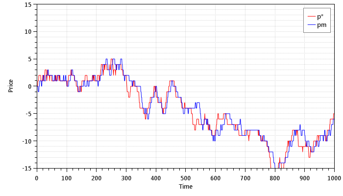
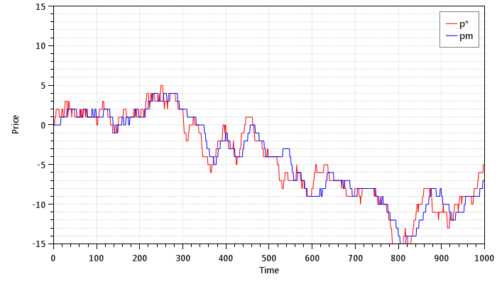
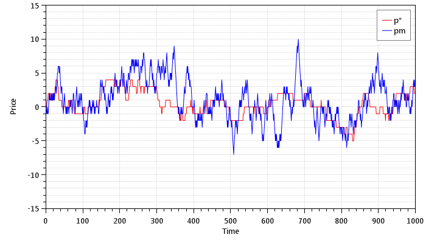
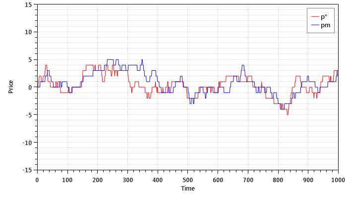
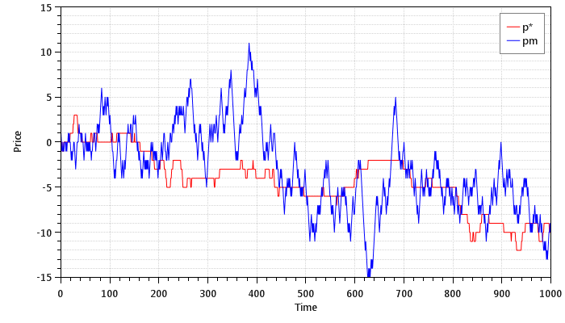
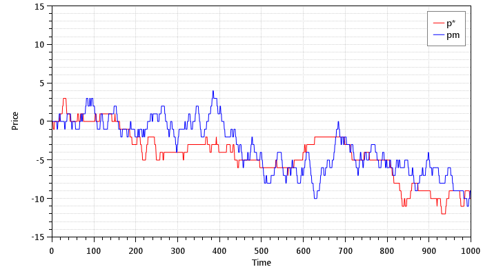
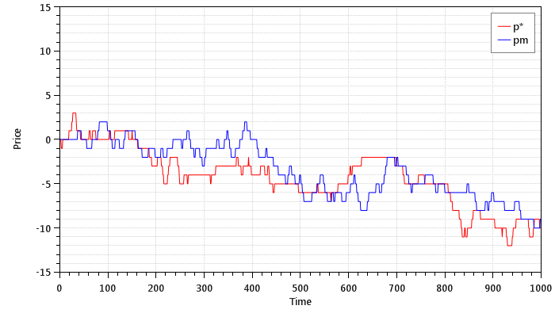

## Overview

This is a study of [*An Electronic Market-Maker*](http://dspace.mit.edu/handle/1721.1/7220) by Nicholas Tung Chan and Christian Shelton.

#### 01 - Expected Profit

This is a Monte Carlo simulation of the basic model that computes the expected profit. The following is a reproduction of Figure 3 from the paper:

These are plots of the true price and market price for strategies 1, 2, and 3, respectively, when the noise factor alphaU = 0.4:

These are plots of the true price and market price for strategies 1, 2, and 3, respectively, when the noise factor alphaU = 1.0:

These are plots of the true price and market price for strategies 1, 2, and 3, respectively, when the noise factor alphaU = 1.6:

